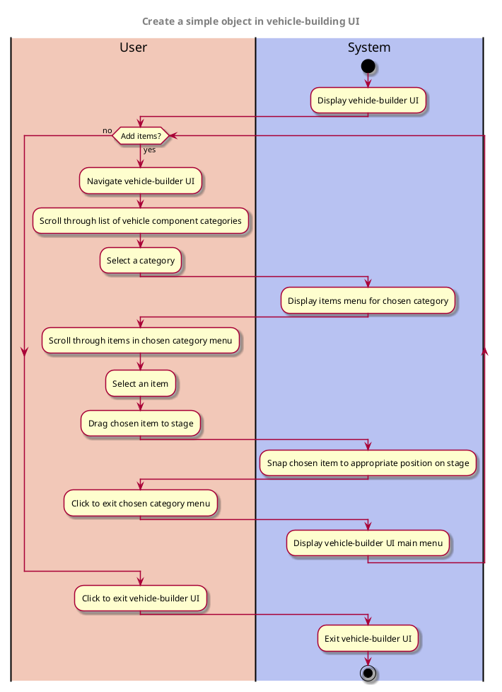

```plantuml
@startuml
title Create a simple object in vehicle-building UI
skin rose
skinparam backgroundColor transparent
skinparam titleFontColor grey
skinparam defaultFontName Aapex

'define swimlanes
|#f2c8b8|User|
|#b8c2f2|System|

|System|
start
:Display vehicle-builder UI;
|User|
while (Add items?) is (yes)
:Navigate vehicle-builder UI;
:Scroll through list of vehicle component categories;
:Select a category;
|System|
:Display items menu for chosen category;
|User|
:Scroll through items in chosen category menu;
:Select an item;
:Drag chosen item to stage;
|System|
:Snap chosen item to appropriate position on stage;
|User|
:Click to exit chosen category menu;
|System|
:Display vehicle-builder UI main menu;
endwhile (no)
|User|
:Click to exit vehicle-builder UI;
|System|
:Exit vehicle-builder UI;
stop
@enduml
```
